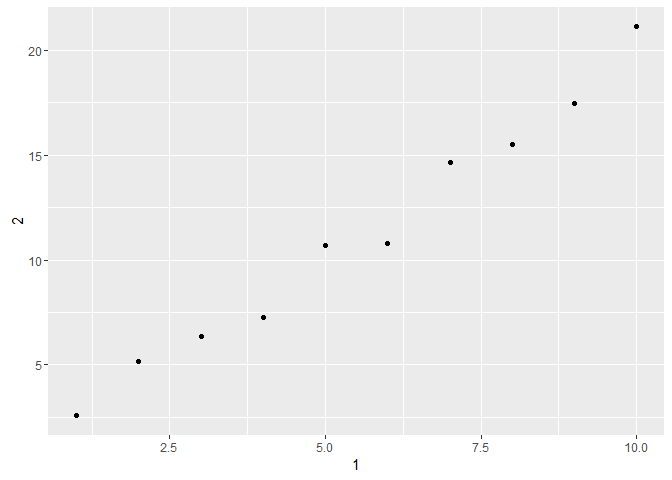

# Tibbles_R_Club_May_31st
Akiva Shalit-Kaneh  
May 30, 2017  


```r
library(tidyverse)
```

```
## Loading tidyverse: ggplot2
## Loading tidyverse: tibble
## Loading tidyverse: tidyr
## Loading tidyverse: readr
## Loading tidyverse: purrr
## Loading tidyverse: dplyr
```

```
## Conflicts with tidy packages ----------------------------------------------
```

```
## filter(): dplyr, stats
## lag():    dplyr, stats
```

## Chapter 10 Tibbles

# 10.5 Exercises

1.How can you tell if an object is a tibble? (Hint: try printing mtcars, which is a regular data frame).

As seen below, when you print a dataframe the whole dataframe is printed. When you print a tibble only the first 10 or so rows will be printed and only the columns that fit in the console.


```r
print(mtcars)
```

```
##                      mpg cyl  disp  hp drat    wt  qsec vs am gear carb
## Mazda RX4           21.0   6 160.0 110 3.90 2.620 16.46  0  1    4    4
## Mazda RX4 Wag       21.0   6 160.0 110 3.90 2.875 17.02  0  1    4    4
## Datsun 710          22.8   4 108.0  93 3.85 2.320 18.61  1  1    4    1
## Hornet 4 Drive      21.4   6 258.0 110 3.08 3.215 19.44  1  0    3    1
## Hornet Sportabout   18.7   8 360.0 175 3.15 3.440 17.02  0  0    3    2
## Valiant             18.1   6 225.0 105 2.76 3.460 20.22  1  0    3    1
## Duster 360          14.3   8 360.0 245 3.21 3.570 15.84  0  0    3    4
## Merc 240D           24.4   4 146.7  62 3.69 3.190 20.00  1  0    4    2
## Merc 230            22.8   4 140.8  95 3.92 3.150 22.90  1  0    4    2
## Merc 280            19.2   6 167.6 123 3.92 3.440 18.30  1  0    4    4
## Merc 280C           17.8   6 167.6 123 3.92 3.440 18.90  1  0    4    4
## Merc 450SE          16.4   8 275.8 180 3.07 4.070 17.40  0  0    3    3
## Merc 450SL          17.3   8 275.8 180 3.07 3.730 17.60  0  0    3    3
## Merc 450SLC         15.2   8 275.8 180 3.07 3.780 18.00  0  0    3    3
## Cadillac Fleetwood  10.4   8 472.0 205 2.93 5.250 17.98  0  0    3    4
## Lincoln Continental 10.4   8 460.0 215 3.00 5.424 17.82  0  0    3    4
## Chrysler Imperial   14.7   8 440.0 230 3.23 5.345 17.42  0  0    3    4
## Fiat 128            32.4   4  78.7  66 4.08 2.200 19.47  1  1    4    1
## Honda Civic         30.4   4  75.7  52 4.93 1.615 18.52  1  1    4    2
## Toyota Corolla      33.9   4  71.1  65 4.22 1.835 19.90  1  1    4    1
## Toyota Corona       21.5   4 120.1  97 3.70 2.465 20.01  1  0    3    1
## Dodge Challenger    15.5   8 318.0 150 2.76 3.520 16.87  0  0    3    2
## AMC Javelin         15.2   8 304.0 150 3.15 3.435 17.30  0  0    3    2
## Camaro Z28          13.3   8 350.0 245 3.73 3.840 15.41  0  0    3    4
## Pontiac Firebird    19.2   8 400.0 175 3.08 3.845 17.05  0  0    3    2
## Fiat X1-9           27.3   4  79.0  66 4.08 1.935 18.90  1  1    4    1
## Porsche 914-2       26.0   4 120.3  91 4.43 2.140 16.70  0  1    5    2
## Lotus Europa        30.4   4  95.1 113 3.77 1.513 16.90  1  1    5    2
## Ford Pantera L      15.8   8 351.0 264 4.22 3.170 14.50  0  1    5    4
## Ferrari Dino        19.7   6 145.0 175 3.62 2.770 15.50  0  1    5    6
## Maserati Bora       15.0   8 301.0 335 3.54 3.570 14.60  0  1    5    8
## Volvo 142E          21.4   4 121.0 109 4.11 2.780 18.60  1  1    4    2
```

```r
A <- as_tibble(mtcars)
print(A)
```

```
## # A tibble: 32 × 11
##      mpg   cyl  disp    hp  drat    wt  qsec    vs    am  gear  carb
## *  <dbl> <dbl> <dbl> <dbl> <dbl> <dbl> <dbl> <dbl> <dbl> <dbl> <dbl>
## 1   21.0     6 160.0   110  3.90 2.620 16.46     0     1     4     4
## 2   21.0     6 160.0   110  3.90 2.875 17.02     0     1     4     4
## 3   22.8     4 108.0    93  3.85 2.320 18.61     1     1     4     1
## 4   21.4     6 258.0   110  3.08 3.215 19.44     1     0     3     1
## 5   18.7     8 360.0   175  3.15 3.440 17.02     0     0     3     2
## 6   18.1     6 225.0   105  2.76 3.460 20.22     1     0     3     1
## 7   14.3     8 360.0   245  3.21 3.570 15.84     0     0     3     4
## 8   24.4     4 146.7    62  3.69 3.190 20.00     1     0     4     2
## 9   22.8     4 140.8    95  3.92 3.150 22.90     1     0     4     2
## 10  19.2     6 167.6   123  3.92 3.440 18.30     1     0     4     4
## # ... with 22 more rows
```


2.Compare and contrast the following operations on a data.frame and equivalent tibble. What is different? Why might the default data frame behaviours cause you frustration?


```r
df <- data.frame(abc = 1, xyz = "a")
df$x
```

```
## [1] a
## Levels: a
```

```r
df[, "xyz"]
```

```
## [1] a
## Levels: a
```

```r
df[, c("abc", "xyz")]
```

```
##   abc xyz
## 1   1   a
```

```r
df_tb <- as_tibble(df)
df_tb$x
```

```
## Warning: Unknown column 'x'
```

```
## NULL
```

```r
df_tb[, "xyz"]
```

```
## # A tibble: 1 × 1
##      xyz
##   <fctr>
## 1      a
```

```r
df_tb[, c("abc", "xyz")]
```

```
## # A tibble: 1 × 2
##     abc    xyz
##   <dbl> <fctr>
## 1     1      a
```

When using a tibble $x does not recognize that you are asking for xyz and gives an error message. when using single square [] xyz is converted to a factorial and when using df_tb[, c("abc", "xyz")] abc is converted to a dbl and xyz to a factorial.

3.If you have the name of a variable stored in an object, e.g. var <- "mpg", how can you extract the reference variable from a tibble?


```r
mtcars_tb <- as_tibble(mtcars)
var <- "mpg"
mtcars_tb[[var]]
```

```
##  [1] 21.0 21.0 22.8 21.4 18.7 18.1 14.3 24.4 22.8 19.2 17.8 16.4 17.3 15.2
## [15] 10.4 10.4 14.7 32.4 30.4 33.9 21.5 15.5 15.2 13.3 19.2 27.3 26.0 30.4
## [29] 15.8 19.7 15.0 21.4
```

4.Practice referring to non-syntactic names in the following data frame by:

   1.Extracting the variable called 1.

   2.Plotting a scatterplot of 1 vs 2.

   3.Creating a new column called 3 which is 2 divided by 1.

   4.Renaming the columns to one, two and three.
   
   

```r
annoying <- tibble(
  `1` = 1:10,
  `2` = `1` * 2 + rnorm(length(`1`))
)
```
 1.
 
 
 

```r
annoying[[1]]
```

```
##  [1]  1  2  3  4  5  6  7  8  9 10
```

2.


```r
ggplot(annoying, aes(`1`, `2`)) +
  geom_point()
```

<!-- -->

3.


```r
annoying_plus <- mutate(annoying, `3` = `2` / `1`)
```


4.

```r
annoying_plus_names <- rename(annoying_plus, One = `1`, Two = `2`, Three = `3`)
```


5. What does tibble::enframe() do? When might you use it?


```r
tibble::enframe(1:10)
```

```
## # A tibble: 10 × 2
##     name value
##    <int> <int>
## 1      1     1
## 2      2     2
## 3      3     3
## 4      4     4
## 5      5     5
## 6      6     6
## 7      7     7
## 8      8     8
## 9      9     9
## 10    10    10
```

This makes a tibble and adds a serial number column.


6.What option controls how many additional column names are printed at the footer of a tibble?

options(tibble.print_max = n, tibble.print_min = m): if more than m rows, print only n rows.
Use options(dplyr.print_min = Inf) to always show all rows.
Use options(tibble.width = Inf)


