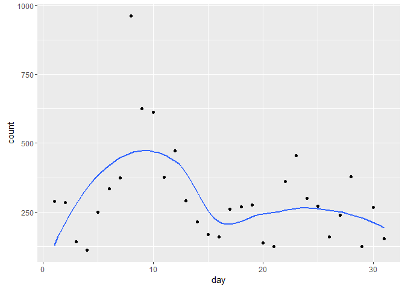
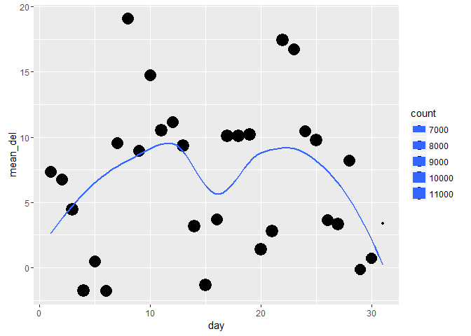
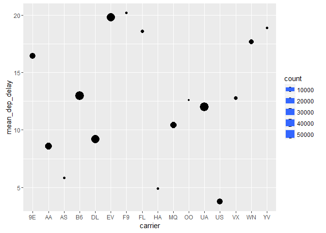
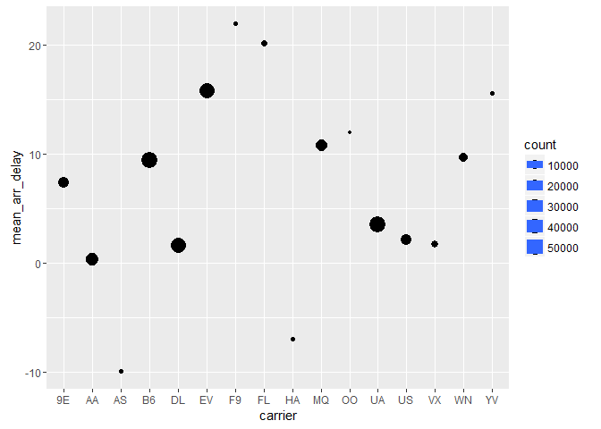
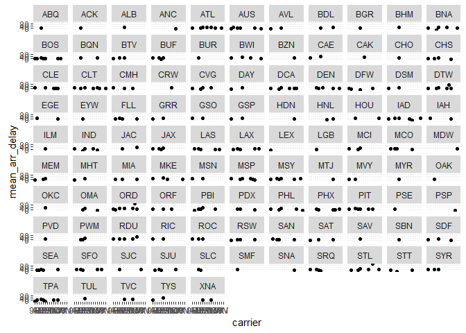
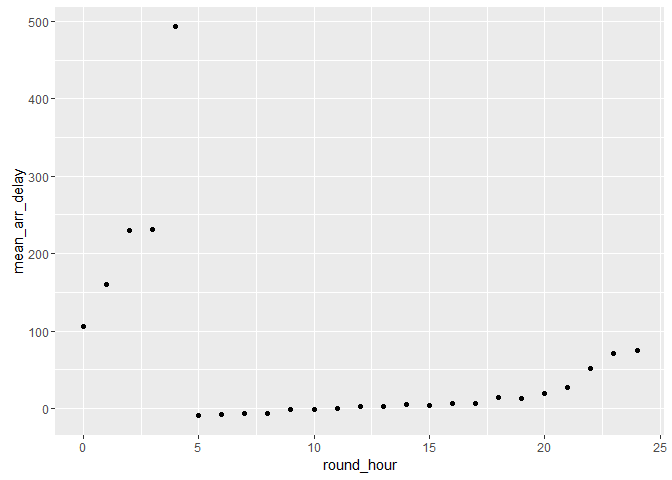
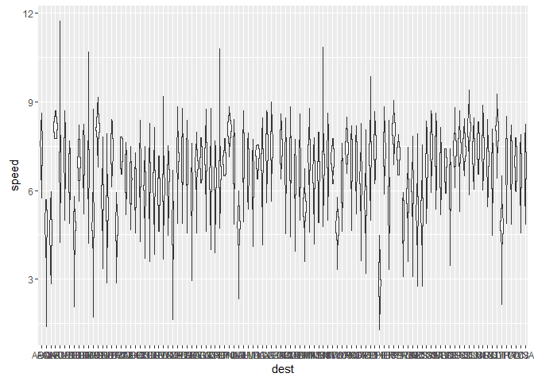

# R_club_May_17th_dplyr
Akiva Shalit-Kaneh  
May 13, 2017  


## 5.6 Grouped Summaries


```r
install.packages("https://cran.r-project.org/src/contrib/nycflights13_0.2.2.tar.gz", repos=NULL, method="libcurl")
```

```
## Installing package into 'C:/Users/Akiva/Documents/R/win-library/3.3'
## (as 'lib' is unspecified)
```


```r
library(nycflights13)
library(tidyverse)
```

```
## Loading tidyverse: ggplot2
## Loading tidyverse: tibble
## Loading tidyverse: tidyr
## Loading tidyverse: readr
## Loading tidyverse: purrr
## Loading tidyverse: dplyr
```

```
## Conflicts with tidy packages ----------------------------------------------
```

```
## filter(): dplyr, stats
## lag():    dplyr, stats
```

## Exercise 5.6.7

1.

```r
Delayed_flights <- flights %>% group_by(flight) %>% summarise(count = n(), n_15_early =  sum(dep_delay == -15, na.rm = TRUE),
n_15_late = sum(dep_delay == 15, na.rm = TRUE),
n_allways_10_late = sum(dep_delay == 10, na.rm = TRUE),
n_30_early = sum(dep_delay == -30, na.rm =TRUE),
n_30_late = sum(dep_delay == 30, na.rm = TRUE),
n_on_time = sum(dep_delay ==0, na.rm = TRUE),
n_2hr_late = sum(dep_delay > 120, na.rm = TRUE))
A<-filter(Delayed_flights, n_15_early == count/2)
B<-filter(Delayed_flights, n_15_late == count/2)
C<-filter(Delayed_flights, n_allways_10_late == count)
D<-filter(Delayed_flights, n_30_early == count/2)
E<-filter(Delayed_flights, n_30_late == count/2)
F<-filter(Delayed_flights, n_on_time == count*99/100 & n_2hr_late == count/100)
```

2.Rewrite the below code to run without count()

```r
not_cancelled <- flights %>% 
  filter(!is.na(dep_delay), !is.na(arr_delay))
not_cancelled %>% count(dest)
```

```
## # A tibble: 104 × 2
##     dest     n
##    <chr> <int>
## 1    ABQ   254
## 2    ACK   264
## 3    ALB   418
## 4    ANC     8
## 5    ATL 16837
## 6    AUS  2411
## 7    AVL   261
## 8    BDL   412
## 9    BGR   358
## 10   BHM   269
## # ... with 94 more rows
```

```r
not_cancelled %>% count(tailnum, wt = distance)
```

```
## # A tibble: 4,037 × 2
##    tailnum      n
##      <chr>  <dbl>
## 1   D942DN   3418
## 2   N0EGMQ 239143
## 3   N10156 109664
## 4   N102UW  25722
## 5   N103US  24619
## 6   N104UW  24616
## 7   N10575 139903
## 8   N105UW  23618
## 9   N107US  21677
## 10  N108UW  32070
## # ... with 4,027 more rows
```


```r
not_cancelled <- flights %>% 
  filter(!is.na(dep_delay), !is.na(arr_delay))
not_cancelled %>%
  group_by(dest) %>%
  summarise(n = n())
```

```
## # A tibble: 104 × 2
##     dest     n
##    <chr> <int>
## 1    ABQ   254
## 2    ACK   264
## 3    ALB   418
## 4    ANC     8
## 5    ATL 16837
## 6    AUS  2411
## 7    AVL   261
## 8    BDL   412
## 9    BGR   358
## 10   BHM   269
## # ... with 94 more rows
```

```r
not_cancelled %>%
  group_by(tailnum) %>%
  summarise(n = n())
```

```
## # A tibble: 4,037 × 2
##    tailnum     n
##      <chr> <int>
## 1   D942DN     4
## 2   N0EGMQ   352
## 3   N10156   145
## 4   N102UW    48
## 5   N103US    46
## 6   N104UW    46
## 7   N10575   269
## 8   N105UW    45
## 9   N107US    41
## 10  N108UW    60
## # ... with 4,027 more rows
```

3.After looking at the below data it seems that departure delay is the most important for canceled flights. The could be an arrival delay for instance that is na because the flight was re-routed to a different air port.

```r
cancelled <- flights %>% 
  filter(is.na(dep_delay) | is.na(arr_delay))
head(cancelled, 20)
```

```
## # A tibble: 20 × 19
##     year month   day dep_time sched_dep_time dep_delay arr_time
##    <int> <int> <int>    <int>          <int>     <dbl>    <int>
## 1   2013     1     1     1525           1530        -5     1934
## 2   2013     1     1     1528           1459        29     2002
## 3   2013     1     1     1740           1745        -5     2158
## 4   2013     1     1     1807           1738        29     2251
## 5   2013     1     1     1939           1840        59       29
## 6   2013     1     1     1952           1930        22     2358
## 7   2013     1     1     2016           1930        46       NA
## 8   2013     1     1       NA           1630        NA       NA
## 9   2013     1     1       NA           1935        NA       NA
## 10  2013     1     1       NA           1500        NA       NA
## 11  2013     1     1       NA            600        NA       NA
## 12  2013     1     2      905            822        43     1313
## 13  2013     1     2     1125            925       120     1445
## 14  2013     1     2     1848           1840         8     2333
## 15  2013     1     2     1849           1724        85     2235
## 16  2013     1     2     1927           1930        -3     2359
## 17  2013     1     2     2041           2045        -4       NA
## 18  2013     1     2     2145           2129        16       NA
## 19  2013     1     2       NA           1540        NA       NA
## 20  2013     1     2       NA           1620        NA       NA
## # ... with 12 more variables: sched_arr_time <int>, arr_delay <dbl>,
## #   carrier <chr>, flight <int>, tailnum <chr>, origin <chr>, dest <chr>,
## #   air_time <dbl>, distance <dbl>, hour <dbl>, minute <dbl>,
## #   time_hour <dttm>
```

4.Look at the number of cancelled flights per day. Is there a pattern? Is the proportion of cancelled flights related to the average delay?

```r
cancelled <- flights %>% 
  filter(is.na(dep_delay) | is.na(arr_delay))
By_Day <- cancelled %>% group_by(day) %>% summarise(count = n())
ggplot(data = By_Day, mapping = aes(x = day, y = count)) + 
geom_point() + 
geom_smooth(se = FALSE)
```

<!-- -->

There are more canceled flights  in the second week of the month.


```r
not_cancelled <- flights %>% 
  filter(!is.na(dep_delay), !is.na(arr_delay))
By_Day_not_c <- not_cancelled %>% group_by(day) %>% summarise(count = n(), mean_del = mean(arr_delay))
ggplot(data = By_Day_not_c, mapping = aes(x = day, y = mean_del, size = count)) + 
geom_point() + 
geom_smooth(se = FALSE)
```

<!-- -->


There is a positive correlation between cancelations and length of delay in the first half of the month but not in the second.

5. 

```r
Delayed_carriers <- flights %>%
  filter(!is.na(dep_delay), !is.na(arr_delay))
Del_carrier <- Delayed_carriers %>% group_by(carrier) %>% summarise(count = n(), mean_dep_delay = mean(dep_delay), mean_arr_delay = mean(arr_delay))
ggplot(data = Del_carrier, mapping = aes(x = carrier, y = mean_dep_delay, size = count)) + 
geom_point() + 
geom_smooth(se = FALSE)
```

<!-- -->

```r
ggplot(data = Del_carrier, mapping = aes(x = carrier, y = mean_arr_delay, size = count)) + 
geom_point() + 
geom_smooth(se = FALSE)
```

<!-- -->

EV is the airlne with the most departure delays and also it has a high number of arrival delays.

6.

```r
Analysis <- flights %>%
  filter(!is.na(dep_delay), !is.na(arr_delay)) %>% group_by(carrier, dest) %>% summarise(n(), mean_dep_delay = mean(dep_delay), mean_arr_delay = mean(arr_delay))
ggplot(data = Analysis, mapping = aes(x = carrier, y = mean_arr_delay)) + 
geom_point() +
facet_wrap(~dest)
```

<!-- -->

## 5.7.1 Exercises

1. 

```r
Analysis <- flights %>%
  filter(!is.na(dep_delay), !is.na(arr_delay)) %>% group_by(carrier, dest)
```

2.Which plane (tailnum) has the worst on-time record?


```r
Worst <- flights %>% filter(!is.na(arr_delay)) %>% group_by(tailnum) %>% summarise(mean_arr_delay = mean(arr_delay))
Worst_ordered <- arrange(Worst, desc(mean_arr_delay ))
head(Worst_ordered,10)
```

```
## # A tibble: 10 × 2
##    tailnum mean_arr_delay
##      <chr>          <dbl>
## 1   N844MH       320.0000
## 2   N911DA       294.0000
## 3   N922EV       276.0000
## 4   N587NW       264.0000
## 5   N851NW       219.0000
## 6   N928DN       201.0000
## 7   N7715E       188.0000
## 8   N654UA       185.0000
## 9   N665MQ       174.6667
## 10  N427SW       157.0000
```

Plane N844MH

3.What time of day should you fly if you want to avoid delays as much as possible?


```r
Optimal_time <- flights %>% filter(!is.na(arr_delay), !is.na(dep_delay), !is.na(dep_time))
Optimal <- mutate(Optimal_time, dep_hours = dep_time %/% 100 , dep_minutes = dep_time %% 100, round_hour = dep_hours + round(dep_minutes/60))
Optimal_time_final <- select(Optimal, round_hour, dep_delay, arr_delay)
Opt_time <- group_by(Optimal_time_final, round_hour) %>% summarise(mean_arr_delay = mean(arr_delay), mean_dep_delay = mean(dep_delay))
Opt_times <- arrange(Opt_time, mean_arr_delay)
ggplot(data = Opt_times, mapping = aes(x = round_hour, y = mean_arr_delay)) + 
  geom_point()
```

<!-- -->

You would want to fly between 5 am and 8 pm.

4. For each destination, compute the total minutes of delay. For each, flight, compute the proportion of the total delay for its destination.


```r
Dest_delays <- flights %>% group_by(dest) %>% filter(!is.na(dep_delay)) %>%  summarise(min_delay_per_dest = sum(dep_delay))
```

Second part?


5. Delays are typically temporally correlated: even once the problem that caused the initial delay has been resolved, later flights are delayed to allow earlier flights to leave. Using lag() explore how the delay of a flight is related to the delay of the immediately preceding flight.


```r
Lag_time <- flights %>% filter(!is.na(arr_delay), !is.na(dep_delay), !is.na(dep_time))
A <- mutate(Lag_time, Lag_delay = lag(dep_delay))
Lag_time_new <- select(A, year:dep_delay, Lag_delay, everything())
Analysis <- summarise(Lag_time_new, count = n(), equal_prev_and_curr_del = sum(dep_delay == Lag_delay, na.rm = TRUE), prev_del_larger_than_curr_del = sum(dep_delay > Lag_delay, na.rm = TRUE),prev_del_smaller_than_curr_del = sum(dep_delay < Lag_delay, na.rm = TRUE))
Analysis_stat <- mutate(Analysis, equal_prev_and_curr_del_stat = equal_prev_and_curr_del/count*100, prev_del_larger_than_curr_del_stat = prev_del_larger_than_curr_del/count*100, prev_del_smaller_than_curr_del_stat = prev_del_smaller_than_curr_del/count*100)
```


6.Look at each destination. Can you find flights that are suspiciously fast? (i.e. flights that represent a potential data entry error). Compute the air time a flight relative to the shortest flight to that destination. Which flights were most delayed in the air?


```r
flights1 <- filter(flights, !is.na(dep_delay), !is.na(arr_delay), !is.na(distance), !is.na(air_time))
flights_speed <- mutate(flights1, speed = distance/air_time)
flights_speed_ordered <- arrange(flights_speed, desc(speed))
ggplot(data = flights_speed_ordered, mapping = aes(x= dest, y= speed)) + geom_violin()
```

<!-- -->
 
7. Find all destinations that are flown by at least two carriers. Use that information to rank the carriers.


```r
A <- arrange(flights, carrier, dest)
group_by(A, carrier) %>%  summarise(count = n())
```

```
## # A tibble: 16 × 2
##    carrier count
##      <chr> <int>
## 1       9E 18460
## 2       AA 32729
## 3       AS   714
## 4       B6 54635
## 5       DL 48110
## 6       EV 54173
## 7       F9   685
## 8       FL  3260
## 9       HA   342
## 10      MQ 26397
## 11      OO    32
## 12      UA 58665
## 13      US 20536
## 14      VX  5162
## 15      WN 12275
## 16      YV   601
```


```r
flights %>%
  group_by(dest) %>%
  filter(n_distinct(carrier) > 2) %>%
  group_by(carrier) %>%
  summarise(n = n_distinct(dest)) %>%
  arrange(-n)
```

```
## # A tibble: 15 × 2
##    carrier     n
##      <chr> <int>
## 1       DL    37
## 2       EV    36
## 3       UA    36
## 4       9E    35
## 5       B6    30
## 6       AA    17
## 7       MQ    17
## 8       WN     9
## 9       OO     5
## 10      US     5
## 11      VX     3
## 12      YV     3
## 13      FL     2
## 14      AS     1
## 15      F9     1
```


