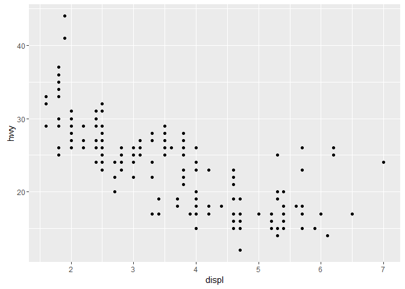

# ggplot2_Akiva_042517
Akiva Shalit-Kaneh  
April 25, 2017  


## 3.2.2 Creating a GGplot with the mpg dataframe



## 3.2.4 Exercises


1. An empty graph.


2. Number of rows in mtcars is 32 and the number of columns is 11.

3. drv stands for drive. Types of drv are:
f = front-wheel drive, r = rear wheel drive, 4 = 4wd

4.


5. GGplot cannot graph Class vs drv since both are chr data.

## 3.3.1 Exercises

1.What’s gone wrong with this code? Why are the points not blue?

> ggplot(data = mpg) + 
  geom_point(mapping = aes(x = displ, y = hwy, color = "blue"))
  
color = "blue" should be outside of the inner aes parentheses.

2. Continuous variables in mpg are: 
displ. engine displacement, in litres
cty. city miles per gallon
hwy. highway miles per gallon

The rest are categorical

3. **Mapping continuous variable cty to color**


```r
ggplot(data = mpg) + 
  geom_point(mapping = aes(x = hwy, y = cyl, color = cty ))
```


  **Mapping continuous variable cty to shape**
  
Returns an Error saying a continuous variable can not be mapped to shape.


  **Mapping continuous variable cty to size**
  

```r
ggplot(data = mpg) + 
  geom_point(mapping = aes(x = hwy, y = cyl, size = cty ))
```


  
## Continuous variables need continuous representation, this is why size and color work for cty but not shape.

4. **Mappin the same variabe to multiple aesthetics**


```r
ggplot(data = mpg) + 
  geom_point(mapping = aes(x = hwy, y = cyl, size = cty, color = cty ))
```


## Both aesthetics are used.

5. The stroke aesthetic is used to modify the width of the border of a shape.

6. When a you map an aesthetic to something other than a variable name you get FALSE for a single aesthetic such as color below.


```r
ggplot(data = mpg) + 
  geom_point(mapping = aes(x = hwy, y = cyl, color = cty<5 ))
```


## 3.5.1 Exercises

1. Faceting on a continuous variable works.


```r
ggplot(data = mpg) + 
  geom_point(mapping = aes(x = displ, y = hwy)) + 
  facet_wrap(~ cty, nrow = 2)
```


2. The below plot explains why there were empty cells in drv~cyl faceting, certain combinations do not exist.


```r
ggplot(data = mpg) + 
  geom_point(mapping = aes(x = drv, y = cyl))
```


3. The below codes use ~. to facet with only one categorical variable and to choose whether to facet to rows of cells or columns.

```r
ggplot(data = mpg) + 
  geom_point(mapping = aes(x = displ, y = hwy)) +
  facet_grid(drv ~ .)
```


```r
ggplot(data = mpg) + 
  geom_point(mapping = aes(x = displ, y = hwy)) +
  facet_grid(. ~ cyl)
```


4. When faceting instead of coloring you have more focus on each category. On the other hand you do not have all the data on the same graph. The larger the data set the more important it will be to facet due to overcrowded plots.

5.In facetwrap nrow and ncol control the number of rowns and columns the facets appear in. This does not exist in facetgrid because there the number of categries withing the category variable chosen dictates the number of rows or columns.

6.For best use of space.
