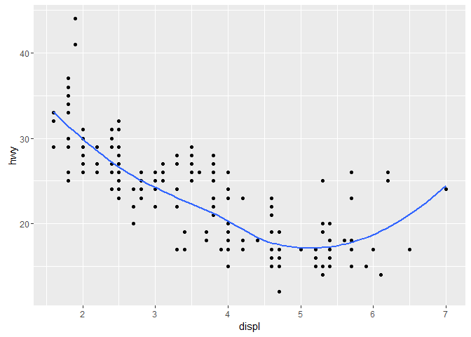
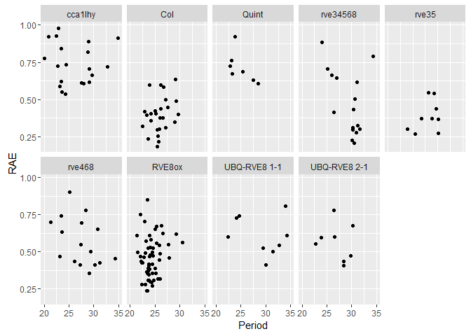

# ggplot2_Akiva_050317
Akiva Shalit-Kaneh  
May 2, 2017  


## Excercises 3.6.1

1. geom_line, geom_boxplot, geom_histogram, geom_area.

2.Prediction for the below code: geom_smooth will not use the standard error (se).


```r
ggplot(data = mpg, mapping = aes(x = displ, y = hwy, color = drv)) + 
  geom_point() + 
  geom_smooth(se = FALSE)
```

<!-- -->

3.show.legend = FALSE will remove the legend.
Question: Could it be used in the ggplot line or must it be in the geom line?

4.The argument se will change the status of the standard error in the graph.

5.Both of the below codes are the same. The first one just enables easily changing the variable for both layers simultaniously.

```r
ggplot(data = mpg, mapping = aes(x = displ, y = hwy)) + 
  geom_point() + 
  geom_smooth()
```

<!-- -->


```r
ggplot() + 
  geom_point(data = mpg, mapping = aes(x = displ, y = hwy)) + 
  geom_smooth(data = mpg, mapping = aes(x = displ, y = hwy))
```

<!-- -->

6.Reproducing code for the example graphs:


```r
ggplot(data = mpg, mapping = aes(x = displ, y = hwy)) + 
  geom_point() + 
  geom_smooth(se = FALSE)
```

<!-- -->


```r
ggplot(data = mpg, mapping = aes(x = displ, y = hwy, group = drv)) + 
  geom_point() + 
  geom_smooth(se = FALSE)
```

<!-- -->


```r
ggplot(data = mpg) + 
  geom_point(mapping = aes(x = displ, y = hwy, group = drv, color = drv)) + 
  geom_smooth(mapping = aes(x = displ, y = hwy), se = FALSE)
```

<!-- -->


```r
ggplot(data = mpg) + 
  geom_point(mapping = aes(x = displ, y = hwy, group = drv, color = drv)) + 
  geom_smooth(mapping = aes(x = displ, y = hwy, group = drv, linetype = drv), se = FALSE)
```

<!-- -->


```r
ggplot() + 
  geom_point(data = mpg, mapping = aes(x = displ, y = hwy,fill=drv),shape = 21,size=5,stroke=2,colour="white")
```

<!-- -->


## My own data


```r
setwd("C:/Harmer lab/LUC assay data/ORCA_637_30c_ASK_73_73_ct2.5")
All <- read.csv("ORCA637_30c_26.5_170.5.csv",  header = T)
ggplot(data = All) + 
  geom_point(mapping = aes(x = Period, y = RAE)) + 
  facet_wrap(~ Genotype, nrow = 2)
```

<!-- -->


